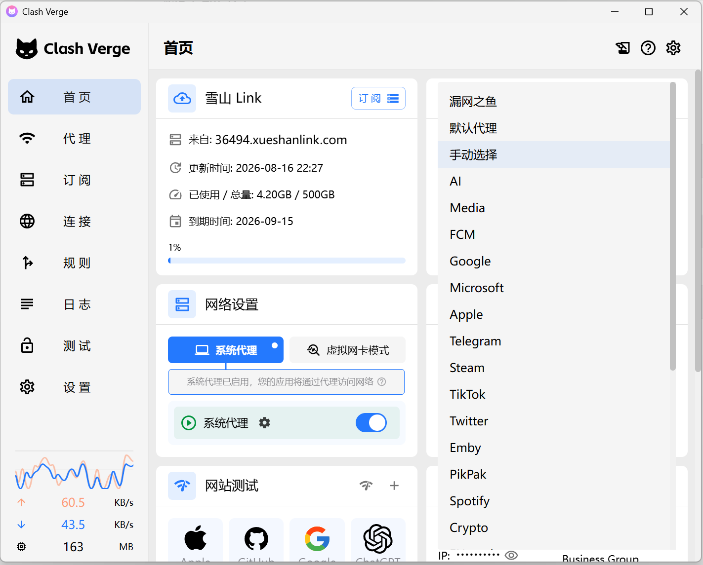
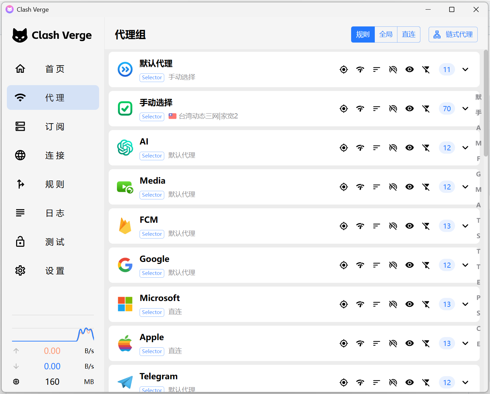
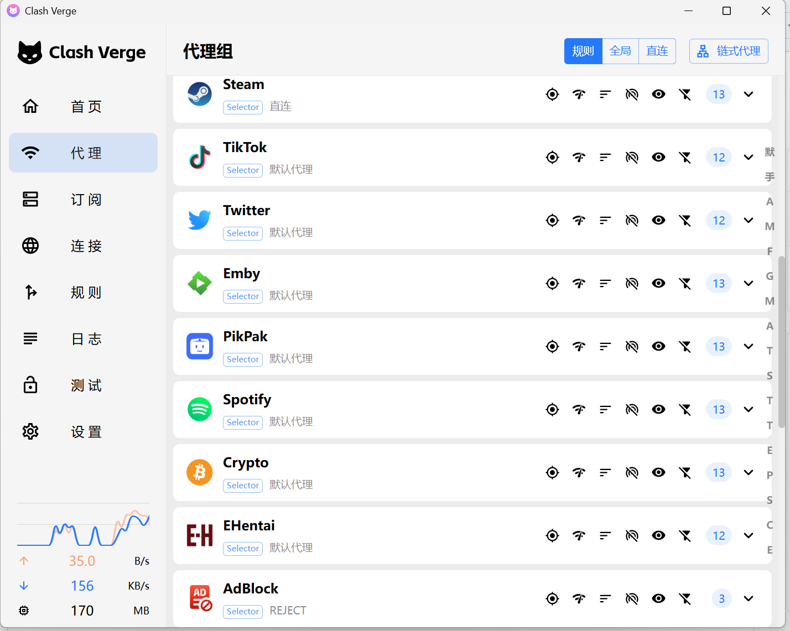
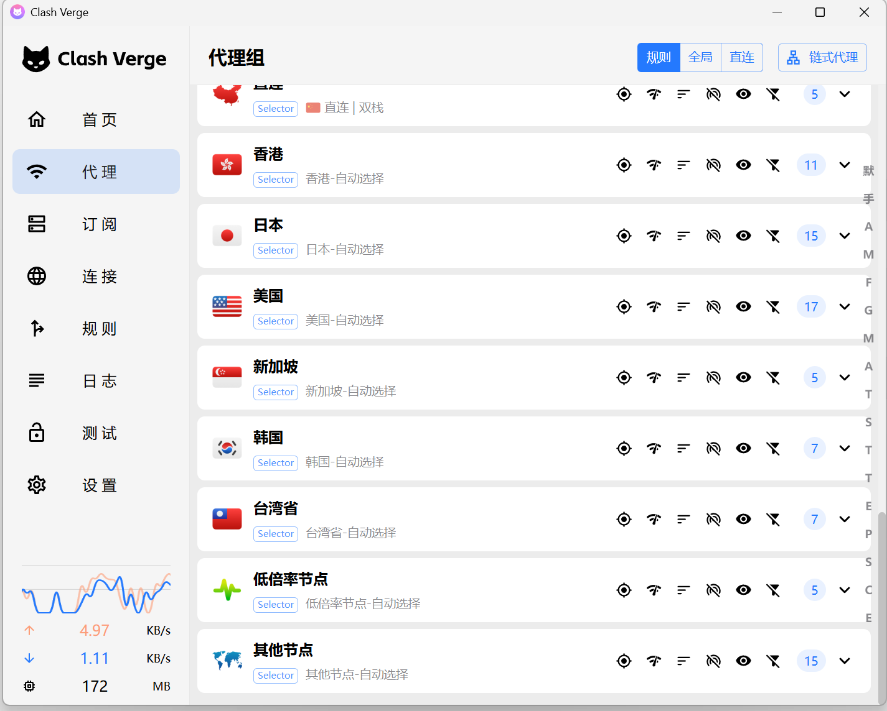
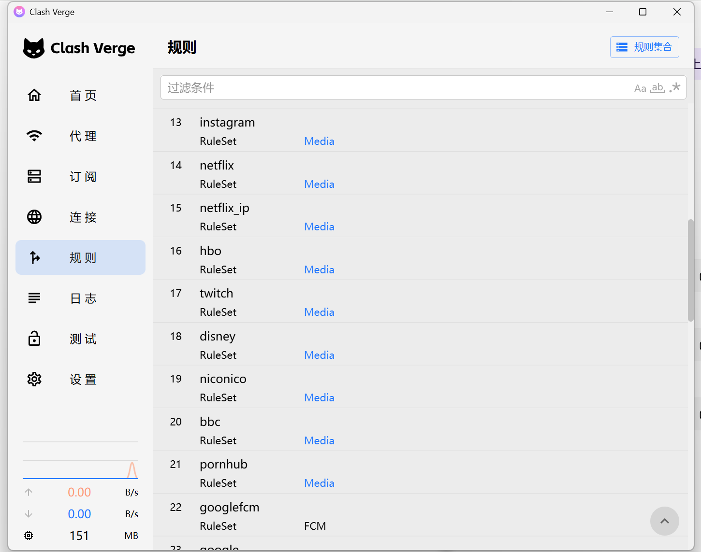

# Clash Verge Custom Script

面向 [Clash Verge Rev](https://github.com/clash-verge-rev/clash-verge-rev) / [Mihomo](https://github.com/MetaCubeX/mihomo) 的全量配置覆写脚本。项目基于 [AIsouler/MyClash](https://github.com/AIsouler/MyClash) 的 `mihomoScript.js` 定制，重点优化代理组组织、地区节点识别、GLOBAL 节点选择、应用分流、DNS/TUN 配置和本机安全默认值。

> [!IMPORTANT]
> 本仓库只提供配置覆写脚本，不提供代理节点、机场订阅、网络接入或相关售卖服务。使用前仍需准备一份包含有效 `proxies` 的 Mihomo/Clash 订阅配置。

## 核心能力

| 能力 | 说明 |
| --- | --- |
| 全量配置覆写 | 统一生成代理组、规则、Rule Provider、DNS、hosts、TUN 与通用 Mihomo 设置 |
| 应用级分流 | 内置 AI、媒体、Google、Microsoft、Telegram、Crypto、AdBlock 等 16 个服务组 |
| 地区与倍率分组 | 自动识别香港、日本、美国、新加坡、韩国、台湾省以及低/高倍率节点 |
| 灵活的 GLOBAL | 全局模式可选择基础组、地区组、自建具体节点、机场节点或双栈直连 |
| 节点清洗 | 过滤伪节点、去重、补全地区 Emoji，并修复重命名后的 `dialer-proxy` 引用 |
| 本机安全默认值 | 默认禁止 LAN 访问，代理端口与 External Controller 仅监听本机 |

## 目录

- [快速开始](#快速开始)
- [效果预览](#效果预览)
- [策略组架构](#策略组架构)
- [网络与解析](#网络与解析)
- [节点过滤与名称规范化](#节点过滤与名称规范化)
- [配置参考](#配置参考)
- [Rule Provider](#rule-provider)
- [注意事项](#注意事项)
- [常见问题](#常见问题)

## 快速开始

### 方法一：复制脚本

1. 打开 [`mihomoScript.js`](./mihomoScript.js) 并复制完整代码。
2. 在 Clash Verge Rev 中打开当前订阅使用的“扩展脚本”或“全局扩展覆写脚本”入口。
3. 粘贴代码并保存，然后重新更新订阅。
4. 在“代理”页面检查 `默认代理`、应用分流组和地区组是否已经生成。

Clash Verge Rev 不同版本的菜单名称可能略有差异。关键是让该 JavaScript 在订阅配置加载时作为 Mihomo 覆写脚本执行。

### 方法二：使用 GitHub Raw

需要远程脚本 URL 时，可使用：

```text
https://raw.githubusercontent.com/hh1848/Clash-Verge-Custom-Script/main/mihomoScript.js
```

[打开 Raw 脚本](https://raw.githubusercontent.com/hh1848/Clash-Verge-Custom-Script/main/mihomoScript.js)

### 推荐模式

日常使用建议保持“规则”模式，并分别设置 `默认代理`、`AI`、`Media`、`Google`、`Crypto` 等策略组。临时需要让所有代理流量使用同一策略或节点时，切换到“全局”模式后在 `GLOBAL` 中选择即可。

## 效果预览

### 首页与代理模式

[](docs/images/home-overview.png)

<table>
  <tr>
    <td align="center" width="50%">
      <strong>基础与核心分流组</strong><br><br>
      <a href="docs/images/proxy-groups-core.png">
        
      </a>
    </td>
    <td align="center" width="50%">
      <strong>更多应用分流组</strong><br><br>
      <a href="docs/images/proxy-groups-services.png">
        
      </a>
    </td>
  </tr>
  <tr>
    <td align="center" width="50%">
      <strong>地区与倍率节点组</strong><br><br>
      <a href="docs/images/proxy-groups-regions.png">
        
      </a>
    </td>
    <td align="center" width="50%">
      <strong>规则集合</strong><br><br>
      <a href="docs/images/rule-providers.png">
        
      </a>
    </td>
  </tr>
</table>

点击任意图片可查看原始尺寸。

## 策略组架构

脚本会读取订阅中的原始节点，完成过滤与名称规范化后，依次生成基础组、地区组、应用分流组、GLOBAL、直连组和最终规则：

```text
订阅 proxies
  └─ 节点过滤、去重与名称规范化
      ├─ 基础策略组
      ├─ 地区 / 倍率策略组
      ├─ 应用分流策略组
      ├─ 自建 / 链式代理组（可选）
      └─ GLOBAL + 直连 + 漏网之鱼
```

### 基础策略组

| 策略组 | 类型 | 行为 |
| --- | --- | --- |
| `手动选择` | `select` | 包含清洗后的全部可用机场节点 |
| `自动选择` | `url-test` | 定期测速并选择延迟较低的节点 |
| `负载均衡` | `load-balance` | 使用 `sticky-sessions` 分配连接 |

测速与健康检查共用以下参数：

```yaml
interval: 600
timeout: 3000
url: https://g.cn/generate_204
lazy: true
max-failed-times: 3
empty-fallback: REJECT
```

`自动选择` 与地区自动选择组另设 `tolerance: 50`；`自动选择` 和 `负载均衡` 会排除 `DIRECT` 类型节点。

### 默认代理与应用分流组

`默认代理` 汇总已启用的基础组、地区手动选择组和自建/链式组。各应用分流组默认从这些上层策略中选择；开启 `分流组添加所有节点` 后，应用组还会直接包含所有具体节点。

| 策略组 | 主要用途 | 脚本默认选择 | 可选直连 |
| --- | --- | --- | :---: |
| `AI` | AI / 大模型相关服务 | 美国 | — |
| `Media` | YouTube、Instagram、Netflix、HBO、Twitch、Disney+、Niconico、BBC、Pornhub | 日本 | — |
| `FCM` | Google Firebase Cloud Messaging | 直连 | ✓ |
| `Google` | Google 域名与 IP | — | — |
| `Microsoft` | Microsoft；GitHub 规则归入 `默认代理` | — | ✓ |
| `Apple` | Apple 服务 | — | ✓ |
| `Telegram` | Telegram 域名与 IP | — | — |
| `Steam` | Steam | — | ✓ |
| `TikTok` | TikTok | 日本 | — |
| `Twitter` | Twitter / X 域名与 IP | — | — |
| `Emby` | Emby、相关域名、客户端进程与 EMOS 规则 | — | ✓ |
| `PikPak` | PikPak | — | ✓ |
| `Spotify` | Spotify | — | ✓ |
| `Crypto` | 加密货币相关网站与服务 | 日本 | ✓ |
| `EHentai` | EHentai | 美国 | — |
| `AdBlock` | 广告拦截 | — | `REJECT` / `REJECT-DROP` / `PASS` |

`profile.store-selected: true` 会保留用户已经做过的策略组选择。因此，更新订阅后，界面中的现有选择可能优先于上表的 `default-selected`。

### 地区与倍率分组

脚本根据节点名称和地区缩写识别以下区域：

| 组名 | 常见识别内容 |
| --- | --- |
| 香港 | 🇭🇰、香港、HK/HKG、Hong Kong |
| 日本 | 🇯🇵、日本、樱花、JP/JPN、Japan |
| 美国 | 🇺🇸、美国、US/USA、America、United States |
| 新加坡 | 🇸🇬、新加坡、狮城、SG/SGP、Singapore |
| 韩国 | 🇰🇷、韩国、首尔、KR/KOR、Korea、Seoul |
| 台湾省 | 🇹🇼、台湾、TW/TWN、Taiwan |

默认开启 `生成地区自动选择组`。每个有节点的地区通常生成两层结构：

```text
日本
├─ 日本-自动选择
├─ 🇯🇵 日本节点 01
├─ 🇯🇵 日本节点 02
└─ ...
```

`生成倍率组` 默认开启，会根据节点名称生成 `低倍率节点` 和存在匹配项时的 `高倍率节点`；未命中地区规则、但仍通过过滤的节点进入 `其他节点`。关闭 `生成倍率组` 本身只是不生成倍率策略组；高倍率节点是否被删除由 `过滤高倍率节点` 单独控制。

### GLOBAL、漏网之鱼与直连

`GLOBAL` 同时包含：

- 已启用的基础策略组；
- 地区、倍率和其他节点的手动选择组；
- 自建具体节点（如已配置）；
- 所有具体代理节点；
- `🇨🇳 直连 | 双栈`。

因此，全局模式可以直接选择某个节点，而不必再进入多层代理组。规则模式下未被前置或应用规则命中的流量会进入 `漏网之鱼`，可在 `默认代理`、`直连` 和地区组之间选择。

脚本内置五个 Mihomo `direct` 节点，并由 `直连` 策略组统一管理：

```text
🇨🇳 直连 | 双栈
🇨🇳 直连 | IPv4优先
🇨🇳 直连 | IPv6优先
🇨🇳 直连 | 仅IPv4
🇨🇳 直连 | 仅IPv6
```

## 网络与解析

### DNS 与 Fake-IP

脚本会重建 DNS 与 hosts 配置，主要默认值如下：

```yaml
dns:
  enable: true
  ipv6: true
  enhanced-mode: fake-ip
  fake-ip-range: 198.18.0.1/15
  fake-ip-range6: 2001:2::1/48
  cache-algorithm: arc
  use-hosts: true
  use-system-hosts: true
```

- 国内默认 DNS：`223.5.5.5`、`119.29.29.29`。
- 国外 DoH：Cloudflare 与 Google，并通过 `默认代理` 查询。
- 国内域名：由 `rule-set:cn` 分配到国内 DNS。
- 直连 DNS：系统 DNS 加国内默认 DNS。
- Fake-IP 过滤：合并 `private`、`fakeip_filter` 规则和与代理服务器域名匹配的原订阅过滤项。
- 机场私有 DNS / hosts：脚本会提取非公共 DNS，并在满足本地 DNS 监听条件时根据 hosts 映射代理服务器地址。

### TUN 与通用设置

TUN 默认启用：

```yaml
tun:
  enable: true
  stack: system
  auto-route: true
  strict-route: true
  auto-redirect: true
  auto-detect-interface: true
  dns-hijack:
    - any:53
    - tcp://any:53
```

其他关键默认值：

```yaml
mixed-port: 7890
mode: rule
ipv6: true
log-level: info
allow-lan: false
bind-address: 127.0.0.1
external-controller: 127.0.0.1:9090
unified-delay: true
tcp-concurrent: true
find-process-mode: strict
```

`allow-lan: false`、本机回环 `bind-address` 和本机 External Controller 是有意设置的安全默认值。如果需要让手机、平板或其他局域网设备使用电脑上的代理，必须自行评估风险并修改这些值。

## 节点过滤与名称规范化

脚本对订阅节点执行以下处理：

1. 排除 `direct`、`reject`、`rematch` 等非机场代理节点。
2. 过滤公告、流量、到期时间、客服、网址、教程等常见伪节点名称。
3. 按规范化后的名称去重。
4. 根据地区识别结果为没有国旗的节点补充 Emoji 前缀。
5. 修复节点改名后可能失效的 `dialer-proxy` 引用。
6. 按选项过滤高倍率节点，或统一设置代理节点的 IPv4/IPv6 偏好。
7. 当最终没有任何有效代理节点时主动报错，避免生成不可用配置。

`过滤非地区节点` 默认开启，但实现并不是简单删除所有未知地区节点：名称未命中地区时，只要没有匹配全局公告/伪节点过滤规则，仍可保留并进入 `其他节点`。

## 配置参考

### `ruleOptionsEnable`

脚本顶部的 `ruleOptionsEnable` 控制主要模块。当前默认值为：

```javascript
const ruleOptionsEnable = {
  // 基础策略组
  手动选择: true,
  自动选择: true,
  负载均衡: true,

  // 以下为分流策略配置
  AI: true,
  Media: true,
  FCM: true,
  Google: true,
  Microsoft: true,
  Apple: true,
  Telegram: true,
  Steam: true,
  TikTok: true,
  Twitter: true,
  Emby: true,
  PikPak: true,
  Spotify: true,
  Crypto: true,
  EHentai: true,
  AdBlock: true,

  // 以下为非分流策略配置
  生成地区自动选择组: true,
  隐藏地区手动选择组: false,
  生成倍率组: true,
  分流组添加所有节点: false,
  过滤高倍率节点: false,
  过滤非地区节点: true,
  屏蔽国外QUIC: false, // 安全加固：关闭额外第三方 cn_additional 规则源依赖
  代理IPV4优先: false,
  代理IPV6优先: false,
  链式代理: false,
};
```

| 选项 | 影响 |
| --- | --- |
| `隐藏地区手动选择组` | 将地区手动选择组标记为隐藏；它们仍可被其他组引用 |
| `分流组添加所有节点` | 把具体节点直接加入各应用分流组，会显著增加列表长度 |
| `过滤高倍率节点` | 在生成配置前排除匹配高倍率命名规则的节点 |
| `过滤非地区节点` | 配合名称过滤规则清理公告/提示类节点，普通未知地区节点仍可能保留 |
| `屏蔽国外QUIC` | 增加 UDP/443 拦截规则，并启用额外的 `cn_additional` Rule Provider |
| `代理IPV4优先` / `代理IPV6优先` | 两者只开启一个时，为全部过滤后代理统一设置相应 `ip-version` |

### 自定义节点与链式代理

自定义节点入口：

```javascript
const customizeProxies = [];
```

加入合法 Mihomo 节点后，脚本会生成 `自建节点` 组；若名称与机场节点重复，会自动添加 `自建-` 前缀直到名称唯一。

启用：

```javascript
链式代理: true
```

脚本会将自定义节点的 `dialer-proxy` 指向：

```javascript
const dialerProxyName = '链式中转';
```

同时生成 `链式落地` 和 `链式中转` 相关策略组。未添加任何自定义节点却开启链式代理时，脚本会抛出错误：

```text
启用失败，请在脚本中添加自定义节点后尝试
```

## Rule Provider

规则以 Mihomo `.mrs` 为主，默认更新间隔为 `86400` 秒。基础规则始终参与配置；应用分流对应的 Rule Provider 只在该功能启用时加入最终配置。

主要来源：

- [MetaCubeX/meta-rules-dat](https://github.com/MetaCubeX/meta-rules-dat)：基础地理、应用域名与 IP 规则。
- [wwqgtxx/clash-rules](https://github.com/wwqgtxx/clash-rules)：直连与 Fake-IP 过滤规则。
- [217heidai/adblockfilters](https://github.com/217heidai/adblockfilters)：AdBlock 规则。
- [666OS/rules](https://github.com/666OS/rules)：Emby 规则。
- [binaryu/emos-proxy-rule](https://github.com/binaryu/emos-proxy-rule)：EMOS / Emby 补充规则。

`屏蔽国外QUIC` 默认关闭，所以额外的 `cn_additional` 规则源默认不会出现在最终配置中。第三方规则的内容与可用性由各自上游维护者决定。

## 注意事项

1. **本项目不是机场订阅。** 仍需使用包含有效节点的 Mihomo/Clash 配置作为输入。
2. **脚本会重建配置。** DNS、hosts、TUN、代理组、规则及部分通用设置会被覆盖，而不是只追加几条规则。
3. **默认端口是 `7890`。** 环境必须使用其他 `mixed-port` 时，请修改脚本。
4. **默认禁止 LAN 访问。** 这是安全设计，不是故障。
5. **TUN 默认开启。** 不使用虚拟网卡模式时，请调整 `tun.enable`。
6. **地区识别依赖节点名称。** 特殊命名方式可通过修改 `regionDefinitions` 中的正则适配。
7. **规则与图标依赖第三方。** 上游地址、格式或可用性变化可能影响配置更新。

## 常见问题

### 为什么 GLOBAL 同时包含代理组和具体节点？

这是脚本的设计目标。GLOBAL 汇总基础组、地区组、自建具体节点、全部机场节点和双栈直连，使全局模式既能使用自动选择，也能直接指定单个节点。

### 为什么 Crypto 可以选择直连？

`Crypto` 的服务配置显式设置了 `direct: true`，可以根据网络环境在代理策略和 `直连` 之间切换。

### 为什么局域网中的其他设备无法连接电脑代理？

默认配置为：

```yaml
allow-lan: false
bind-address: 127.0.0.1
```

代理端口只对本机开放。如需 LAN 共享，请自行调整配置并做好访问控制。

### 为什么更新订阅后没有恢复脚本的默认选择？

Mihomo 配置启用了：

```yaml
profile:
  store-selected: true
  store-fake-ip: true
```

因此会尽量保留此前的策略选择与 Fake-IP 状态。清除持久化状态后，脚本的 `default-selected` 才可能重新生效。

### 更新订阅时报错怎么办？

优先检查 Clash Verge Rev 日志，常见原因包括：

- 复制脚本时遗漏代码或产生 JavaScript 语法错误；
- 输入订阅没有有效 `proxies`；
- 开启链式代理但没有配置 `customizeProxies`；
- 第三方 Rule Provider 暂时不可访问；
- Mihomo / Clash Verge Rev 版本不支持脚本使用的配置项。

## 项目结构

```text
Clash-Verge-Custom-Script/
├─ mihomoScript.js
├─ README.md
└─ docs/
   └─ images/
      ├─ home-overview.png
      ├─ proxy-groups-core.png
      ├─ proxy-groups-services.png
      ├─ proxy-groups-regions.png
      └─ rule-providers.png
```

## 致谢

本项目基于以下开源项目和公共资源整理与定制：

- [AIsouler/MyClash](https://github.com/AIsouler/MyClash) — 原始 Mihomo 全量覆写脚本。
- [MetaCubeX/mihomo](https://github.com/MetaCubeX/mihomo) — Mihomo 核心。
- [clash-verge-rev/clash-verge-rev](https://github.com/clash-verge-rev/clash-verge-rev) — Clash Verge Rev。
- [MetaCubeX/meta-rules-dat](https://github.com/MetaCubeX/meta-rules-dat) — Mihomo 规则数据。
- [Koolson/Qure](https://github.com/Koolson/Qure) 及脚本中引用的其他图标项目 — 策略组图标。
- 脚本中引用的其他规则维护项目。

感谢所有上游开发者与规则维护者。

## License / 许可说明

本仓库包含基于上游项目修改的代码，同时依赖多个第三方规则与图标资源。各部分版权和许可证归各自原作者所有。

在正式添加 `LICENSE` 文件之前，请先确认原始项目及相关代码的许可证要求，并选择与上游许可兼容的开源协议。

## Disclaimer / 免责声明

本项目仅用于 Mihomo / Clash Verge Rev 配置管理、规则组织和技术研究。本项目不提供代理服务器、不出售网络服务、不提供机场订阅，也不保证第三方规则源永久可用。

使用者应自行确保网络服务、订阅来源和使用方式符合所在地法律法规及相关服务条款，并自行承担因修改或使用配置产生的风险。

如果项目对你有帮助，欢迎点亮 ⭐ Star。Issues 和 Pull Requests 可用于反馈 Bug、节点地区识别问题、规则缺失、兼容性问题和功能改进建议。
